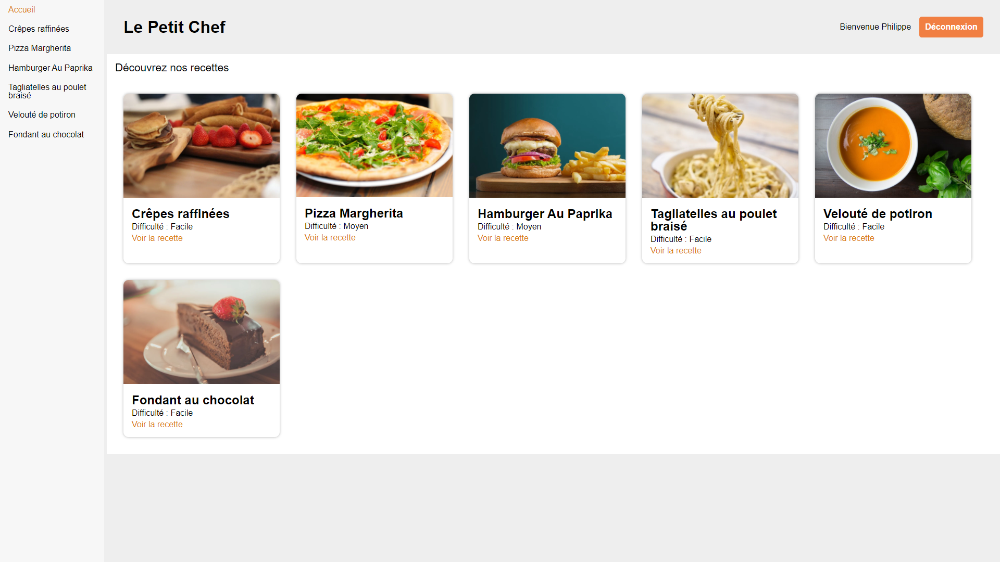

# les-recettes-du-chef

Recipes website built with React and Redux in front end. Datas are comming from an API built with a node server.
There are some tests with Chai and Enzyme.




## How to launch
Clone front and back repositories then execute command below in each folder

Front:
```
yarn
yarn start
```
> [Open page localhost:8080](http://localhost:8080/)

[Back (repository here)](https://github.com/adrienzagar/les-recettes-du-chef-backend):
```
yarn
yarn start
```

## Login

Mail / Password
```
etchebest@gastronomie.com
cauchemar
```

```
mercote@patissere.fr
gateau
```

```
gordon@ramsay.com
hell
```
